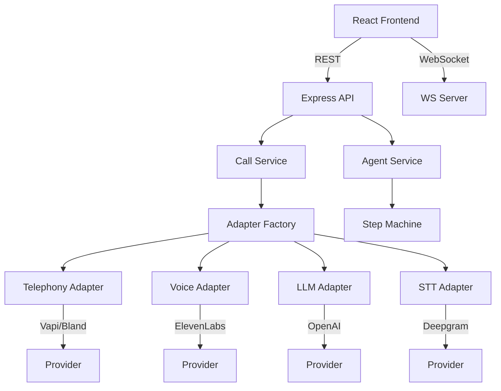

# AI Calling System — API Reference

## Base URL
```
/api/calls    — Call management
/api/agents   — Agent management
/ws/calls     — WebSocket real-time events
```

---

## Calls API

### `POST /api/calls`
Initiate an AI-powered outbound call.

| Param | Type | Required | Description |
|-------|------|----------|-------------|
| `leadId` | string | ✅ | Target lead ID |
| `scriptId` | string | | Call script to use |
| `assistantConfig` | object | | Voice/LLM overrides |

**Response:** `201` — Created call record

---

### `GET /api/calls`
List calls with optional filters.

| Query | Type | Default | Description |
|-------|------|---------|-------------|
| `leadId` | string | | Filter by lead |
| `status` | string | | `in-progress`, `completed`, `failed` |
| `outcome` | string | | `booked`, `follow-up`, `rejected`, `no-answer` |
| `limit` | number | 50 | Page size |
| `offset` | number | 0 | Pagination offset |

**Response:** `200` — `{ calls: Call[], total: number }`

---

### `GET /api/calls/:id`
Get a single call with full details.

**Response:** `200` — Call object including transcript

---

### `PUT /api/calls/:id`
Update call outcome or status.

| Body | Type | Description |
|------|------|-------------|
| `status` | string | Call status |
| `outcome` | string | Call outcome |
| `summary` | string | AI-generated summary |
| `notes` | string | Agent notes |

---

### `GET /api/calls/stats`
Get aggregated call statistics.

**Response:**
```json
{
  "total": 150,
  "today": 12,
  "booked": 45,
  "avgDuration": 185,
  "outcomeBreakdown": {
    "booked": 45,
    "follow-up": 38,
    "rejected": 30,
    "no-answer": 25,
    "failed": 12
  }
}
```

---

### `POST /api/calls/webhook`
Receive telephony provider webhooks (Vapi, Bland, etc.)

| Body | Type | Description |
|------|------|-------------|
| `callId` | string | Provider call ID |
| `status` | string | Provider-specific status |
| `duration` | number | Call duration (seconds) |
| `transcript` | string | Full conversation transcript |

---

### `GET /api/calls/providers`
Get configured telephony providers and their status.

**Response:**
```json
{
  "telephony": { "name": "vapi", "configured": true },
  "voice": { "name": "elevenlabs", "configured": true },
  "llm": { "name": "openai", "configured": true },
  "stt": { "name": "deepgram", "configured": false }
}
```

---

## Scripts API

### `GET /api/calls/scripts`
List all call scripts for the current user.

### `POST /api/calls/scripts`
Create a new call script.

| Body | Type | Description |
|------|------|-------------|
| `name` | string | Script name |
| `objective` | string | Call goal |
| `openingLine` | string | Initial greeting |
| `talkingPoints` | string[] | Conversation points |
| `objectionHandlers` | object[] | `{ objection, response }` pairs |
| `rateRange` | object | `{ min, max }` rate bracket |

### `POST /api/calls/scripts/generate`
AI-generate a script from a prompt.

| Body | Type | Description |
|------|------|-------------|
| `industry` | string | Target industry |
| `objective` | string | Goal description |
| `tone` | string | `professional`, `casual`, `persuasive` |

---

## Agents API

### `GET /api/agents`
List all AI agents for the current user.

### `POST /api/agents`
Spawn a new AI agent.

| Body | Type | Description |
|------|------|-------------|
| `name` | string | Agent name |
| `scriptId` | string | Script to use |
| `leadIds` | string[] | Leads to call |
| `config` | object | `{ delay, autoTranscribe }` |

### `GET /api/agents/:id`
Get agent details with current step and stats.

### `POST /api/agents/:id/start`
Start an idle or paused agent.

### `POST /api/agents/:id/pause`
Pause a running agent between leads.

### `POST /api/agents/:id/resume`
Resume a paused agent.

### `POST /api/agents/:id/stop`
Stop an agent and clean up resources.

### `DELETE /api/agents/:id`
Delete an agent and its records.

### `GET /api/agents/flow-config`
Get the agent step machine configuration (for React Flow visualization).

**Response:** `{ nodes, edges }` — React Flow graph data

---

## WebSocket Protocol

### Endpoint: `/ws/calls`

### Client → Server Messages

| Type | Payload | Effect |
|------|---------|--------|
| `subscribe` | `{ agentId }` | Subscribe to agent events |
| `unsubscribe` | `{ agentId }` | Unsubscribe from agent events |

### Server → Client Messages

| Type | Payload | When |
|------|---------|------|
| `agent:status` | `{ agentId, step, leadId, stats }` | Agent transitions between steps |
| `agent:log` | `{ agentId, message, timestamp }` | Agent activity log entry |
| `call:started` | `{ callId, leadId }` | New call initiated |
| `call:completed` | `{ callId, outcome, duration }` | Call finished |
| `batch:progress` | `{ agentId, completed, total, stats }` | Batch progress update |
| `batch:complete` | `{ agentId, summary }` | Batch run finished |

---

## Architecture



## Environment Variables

| Variable | Required | Description |
|----------|----------|-------------|
| `VAPI_API_KEY` | | Vapi telephony provider key |
| `BLAND_API_KEY` | | Bland AI telephony key |
| `ELEVENLABS_API_KEY` | | Voice synthesis key |
| `OPENAI_API_KEY` | ✅ | LLM for conversation |
| `DEEPGRAM_API_KEY` | | Speech-to-text key |
| `AI_CALLING_MOCK_MODE` | | Set `true` for mock providers |
