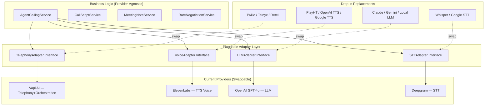
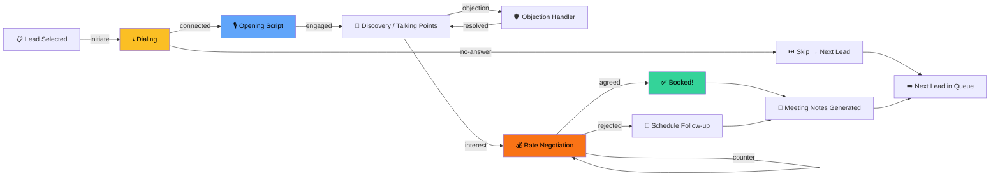

# EPIC: AI Agent Calling System (Pluggable Architecture)

An AI-powered calling agent using **Vapi AI + ElevenLabs + GPT-4o + Deepgram** — with every provider abstracted behind swappable adapters.

---

## Pluggable Architecture

Every external dependency is behind an **adapter interface**. Swap any provider by changing one config line.



### Adapter File Structure

```
server/adapters/
├── telephony/
│   ├── interface.js          # TelephonyAdapter base class
│   ├── vapiAdapter.js        # ✅ Active — Vapi AI
│   ├── twilioAdapter.js      # Swap-in ready
│   └── retellAdapter.js      # Swap-in ready
├── voice/
│   ├── interface.js          # VoiceAdapter base class
│   ├── elevenLabsAdapter.js  # ✅ Active — ElevenLabs
│   └── openaiTTSAdapter.js   # Swap-in ready
├── llm/
│   ├── interface.js          # LLMAdapter base class
│   ├── openaiAdapter.js      # ✅ Active — GPT-4o
│   └── claudeAdapter.js      # Swap-in ready
├── stt/
│   ├── interface.js          # STTAdapter base class
│   ├── deepgramAdapter.js    # ✅ Active — Deepgram
│   └── whisperAdapter.js     # Swap-in ready
└── index.js                  # Factory — reads config, returns active adapters
```

**Config-driven swap** in `.env`:
```env
TELEPHONY_PROVIDER=vapi        # Options: vapi, twilio, retell
VOICE_PROVIDER=elevenlabs      # Options: elevenlabs, openai, playht
LLM_PROVIDER=openai            # Options: openai, claude, gemini
STT_PROVIDER=deepgram          # Options: deepgram, whisper, google
```

---

## React Flow — Live Agent Visualization

**React Flow** (`@xyflow/react` v12 — already installed) powers a real-time visual workflow for each agent. Multiple agents run simultaneously with independent flow views.



### Multi-Agent Flow View

Each agent instance is a React Flow canvas showing:
- **Custom nodes** — color-coded by stage (yellow=dialing, blue=speaking, orange=negotiating, green=booked)
- **Animated edges** — pulse along the current path as the agent progresses
- **Live data overlays** — current lead name, call timer, script line, proposed rate
- **Status badges** — agent health (active/idle/error)

| Component | Purpose |
|-----------|--------|
| `AgentFlowCanvas.tsx` | Single agent's React Flow visualization |
| `AgentFlowNode.tsx` | Custom node types (dial, speak, negotiate, book, skip) |
| `AgentFlowEdge.tsx` | Animated edge with progress indicator |
| `MultiAgentDashboard.tsx` | Grid/tab view showing all active agents side-by-side |
| `AgentFlowControls.tsx` | Play/pause/skip controls per agent |

### Backend Support

- **`AgentInstance`** model tracks each running agent
- WebSocket emits `agent:step-change` events with `{ agentId, fromNode, toNode, data }`
- Frontend subscribes per agent and animates the React Flow graph in real-time

---

## User Review Required

> [!IMPORTANT]
> **API Keys Needed Before Sprint 1**: You'll need accounts + API keys for Vapi AI, ElevenLabs, OpenAI, and Deepgram. The adapter layer supports mock mode for development without real keys.

---

## Proposed Changes

### Sprint 1 — Data Models, Adapters & Core Backend (Week 1-2)

---

#### [MODIFY] [schema.prisma](file:///home/hanzla/development/teaching/schedule-manager/server/prisma/schema.prisma)

Add 4 new models:

- **`Call`** — tracks each call (lead, direction, status, duration, recording, transcription, sentiment, outcome, Vapi callSid)
- **`CallScript`** — reusable call scripts (purpose, talking points, objection handlers, rate range)  
- **`MeetingNote`** — per-call notes with AI summary, action items, decisions
- **`RateNegotiation`** — tracks rate negotiation per call (initial/proposed/final rate, strategy)

Add relations to `User` and `Lead` models.

---

#### [NEW] `server/adapters/` — Pluggable Adapter Layer

Each adapter implements a standard interface:

| Adapter | Interface Methods |
|---------|-------------------|
| **TelephonyAdapter** | `initiateCall()`, `batchCall()`, `getCallStatus()`, `endCall()`, `handleWebhook()` |
| **VoiceAdapter** | `synthesize()`, `getVoices()`, `cloneVoice()` |
| **LLMAdapter** | `complete()`, `generateScript()`, `negotiateRate()`, `summarize()` |
| **STTAdapter** | `transcribe()`, `streamTranscribe()` |

Sprint 1 implements: `vapiAdapter.js`, `elevenLabsAdapter.js`, `openaiAdapter.js`, `deepgramAdapter.js` + factory `index.js`.

---

#### [NEW] Backend Services (provider-agnostic)

| Service | Purpose | Uses Adapters |
|---------|---------|---------------|
| `callService.js` | Call CRUD + orchestration | TelephonyAdapter |
| `callScriptService.js` | Script CRUD + AI generation | LLMAdapter |
| `meetingNoteService.js` | Transcription + summarization | STTAdapter, LLMAdapter |
| `rateNegotiationService.js` | Rate strategy + counter-offers | LLMAdapter |

---

#### [NEW] [calls.js](file:///home/hanzla/development/teaching/schedule-manager/server/routes/calls.js) — REST API

| Method | Endpoint | Purpose |
|--------|----------|---------|
| `GET` | `/api/calls` | List calls (filterable) |
| `POST` | `/api/calls/initiate` | Start outbound call |
| `POST` | `/api/calls/batch` | Queue batch calls |
| `POST` | `/api/calls/:id/notes` | Add meeting notes |
| `PATCH` | `/api/calls/:id` | Update call outcome |
| `GET` | `/api/calls/stats` | Analytics |
| `POST` | `/api/calls/webhook` | Vapi status webhook |
| `GET/POST` | `/api/call-scripts` | Script CRUD |
| `POST` | `/api/calls/:id/negotiate` | Rate negotiation |

---

#### [MODIFY] [index.js](file:///home/hanzla/development/teaching/schedule-manager/server/index.js) — Register new routes

---

### Sprint 2 — AI Agent Brain, Real-Time & Flow Events (Week 2-3)

- **`agentCallingService.js`** — orchestrates batch calling, processes completed calls (transcribe → summarize → extract notes → update lead)
- **`AgentInstance`** Prisma model — tracks each running agent (id, status, currentStep, config, leadQueue)
- **WebSocket** emitting `agent:step-change`, `agent:status`, `call:update` events
- **Agent step machine** — state transitions (lead-selected → dialing → speaking → negotiating → booked/skipped) emitted as flow events
- Extend `/api/agent/execute` with `initiate_call`, `batch_calls`, `get_call_history`, `get_agent_status` actions
- `GET /api/agents` — list active agent instances
- `POST /api/agents` — spawn new agent with lead queue + script
- `PATCH /api/agents/:id` — pause/resume/stop agent

---

### Sprint 3 — Frontend Module + React Flow Visualization (Week 3-4)

```
src/modules/calling/
├── components/
│   ├── CallDashboard.tsx        # Main view — tabs for Dashboard/Agents/Logs/Scripts
│   ├── CallScriptEditor.tsx     # Script builder with AI generation
│   ├── CallLogView.tsx          # History + recordings + transcriptions
│   ├── MeetingNotesPanel.tsx    # Notes + AI summary per call
│   ├── RateNegotiationView.tsx  # Pricing strategy tracker
│   ├── CallCard.tsx             # Call list item
│   ├── ActiveCallWidget.tsx     # Floating in-progress call panel
│   ├── BatchCallLauncher.tsx    # Select leads → launch batch
│   ├── CallStatsChart.tsx       # Analytics charts
│   ├── AgentFlowCanvas.tsx      # ⭐ React Flow — single agent workflow viz
│   ├── AgentFlowNode.tsx        # ⭐ Custom nodes (dial, speak, negotiate, book)
│   ├── AgentFlowEdge.tsx        # ⭐ Animated edges with progress
│   ├── MultiAgentDashboard.tsx  # ⭐ Grid/tabs for all active agents
│   └── AgentFlowControls.tsx    # ⭐ Play/pause/skip per agent
├── hooks/
│   ├── useCalls.ts              # Call API data hook
│   └── useAgentFlow.ts          # ⭐ WebSocket + React Flow state hook
└── index.ts
```

Add `/calling` and `/calling/agents` routes to `routes.tsx` and sidebar nav in `App.tsx`.

---

### Sprint 4 — Integration & Polish (Week 4-5)

- Add "Call" button to `LeadDetailPanel.tsx`
- Add "Batch Call" option to `AutomationView.tsx`
- Build call metrics analytics
- Mock mode for dev without API keys

---

## Sprint Summary

| Sprint | Duration | Key Deliverables |
|--------|----------|------------------|
| **1** | Week 1-2 | Prisma models (Call, CallScript, MeetingNote, RateNegotiation, AgentInstance), adapter layer, services, REST API |
| **2** | Week 2-3 | AI orchestrator, agent step machine, WebSocket events, agent CRUD API |
| **3** | Week 3-4 | 14 React components (incl. 5 React Flow viz), routing, sidebar |
| **4** | Week 4-5 | Lead integration, analytics, mock mode, testing |

## Environment Variables

```env
# Provider Selection (pluggable)
TELEPHONY_PROVIDER=vapi
VOICE_PROVIDER=elevenlabs
LLM_PROVIDER=openai
STT_PROVIDER=deepgram

# Vapi AI
VAPI_API_KEY=your_key
VAPI_PHONE_NUMBER_ID=your_phone_id

# ElevenLabs
ELEVENLABS_API_KEY=your_key
ELEVENLABS_VOICE_ID=your_voice_id

# OpenAI
OPENAI_API_KEY=your_key

# Deepgram
DEEPGRAM_API_KEY=your_key

# Mock Mode (dev without real keys)
CALLING_MOCK_MODE=true
```

## Verification Plan

1. `npx prisma validate --schema=server/prisma/schema.prisma`
2. `curl http://localhost:3002/api/calls` — verify API responds
3. `pnpm run build` — verify frontend compiles
4. Navigate to `/calling` — verify UI renders
5. Toggle `TELEPHONY_PROVIDER` between `vapi` and `mock` — verify adapter swap works
