# AI Agent Calling System — Provider Assessment

A comparison of all viable options across 4 categories: **Voice Agent Platforms**, **VoIP/Telephony**, **AI Voice & TTS**, and **LLM Intelligence**.

---

## Category 1: All-in-One Voice Agent Platforms

These handle the entire call stack (telephony + STT + LLM + TTS) in one platform.

| Platform | Pricing | Latency | Node.js SDK | Best For | Verdict |
|----------|---------|---------|-------------|----------|---------|
| **Vapi AI** ⭐ | $0.05/min base + LLM/STT/TTS (~$0.13-0.33/min total) | <600ms | ✅ Full API | Developers needing full control, custom scripts | **🏆 Top Pick for us** |
| **Retell AI** | $0.07-0.08/min base (~$0.13-0.31/min total) | ~620ms | ✅ REST API | Large campaigns, compliance-heavy | Strong runner-up |
| **Bland AI** | $0.11-0.14/min + $299-499/mo plans | Moderate | ✅ REST API | High-volume simple outbound | Good for scale |
| **Synthflow** | Custom pricing | Low | ❌ No-code | Non-technical teams | Not ideal — no-code |
| **Dialora AI** | Custom pricing | Moderate | ⚠️ Limited | Full-stack automation | Newer, less docs |

> [!TIP]
> **Vapi AI is the best fit** because it's API-first, supports Node.js/Express, lets you bring your own LLM + TTS (including ElevenLabs), and handles telephony + call orchestration. We'd plug it into our existing Express backend.

---

## Category 2: VoIP / Telephony Only

If we use a standalone AI stack, we need a telephony layer.

| Provider | Pricing | Phone Numbers | Key Advantage | Key Drawback |
|----------|---------|---------------|---------------|--------------|
| **Twilio** | $0.013/min outbound + $1/mo number | Global | Industry standard, massive docs | Most expensive at scale |
| **Telnyx** | $0.005/min outbound + $1/mo number | Global | 40-70% cheaper than Twilio | Slightly fewer integrations |
| **Plivo** | $0.01/min outbound + $0.80/mo number | Global | Cost-effective, simple API | Fewer AI integrations |
| **Vonage** | $0.014/min + $1/mo number | Global | Advanced routing | Complex pricing |

> [!NOTE]
> If using Vapi AI (all-in-one), we skip this category — Vapi handles telephony natively with free US numbers. For international, Vapi supports Twilio/Telnyx import.

---

## Category 3: AI Voice & Text-to-Speech (TTS)

For natural-sounding agent voice during calls.

| Provider | Pricing | Voice Quality | Latency | Clone Your Voice | Best For |
|----------|---------|---------------|---------|-----------------|----------|
| **ElevenLabs** ⭐ | $0.07/min via Vapi, or $5-330/mo standalone (15-3600 min) | 🏆 Best in class | ~300ms | ✅ Yes | Most human-like voice |
| **OpenAI TTS** | ~$0.015/1K chars | Very good | ~400ms | ❌ No | Built-in with GPT stack |
| **Deepgram Aura-2** | Included in Voice Agent API | Good, emotive | Very low | ❌ No | Fast + cheap |
| **Google Cloud TTS** | $4-16/1M chars | Good | ~300ms | ❌ No | If already on GCP |
| **PlayHT** | $0.05/min | Excellent | ~350ms | ✅ Yes | Alternative to ElevenLabs |

> [!IMPORTANT]
> **ElevenLabs is the clear winner for TTS quality.** You can use ElevenLabs voices inside Vapi AI — Vapi charges $0.07/min for ElevenLabs premium voices. This gives you the best voice quality without managing ElevenLabs separately.

---

## Category 4: LLM Intelligence (Brain of the Agent)

For understanding context, negotiating rates, generating responses.

| Provider | Model | Pricing (via Vapi) | Intelligence | Speed | Tool Calling |
|----------|-------|-------------------|-------------|-------|-------------|
| **OpenAI GPT-4o** | gpt-4o | $0.05/min | 🏆 Strongest | Fast | ✅ Excellent |
| **OpenAI GPT-4o mini** | gpt-4o-mini | $0.006/min | Good | Very fast | ✅ Good |
| **Claude 3.5 Sonnet** | claude-3.5 | $0.02/min | Excellent | Fast | ✅ Good |
| **Google Gemini 2.5** | gemini-2.5-flash | ~$0.01/min | Excellent | Very fast | ✅ Good |
| **Deepgram + Nova-3** | Deepgram STT | $4.30/1K min | STT only | 🏆 Fastest | N/A |
| **OpenAI Realtime** | gpt-realtime | ~$0.10/min | Best | 300-600ms | ✅ Native |

> [!NOTE]
> For rate negotiation and complex conversations, **GPT-4o** or **Claude 3.5 Sonnet** are the best choices. For cost optimization, start with **GPT-4o mini** and upgrade specific scripts to GPT-4o for closing/negotiation calls.

---

## Category 5: Open-Source / Self-Hosted Options

Full control, no per-minute vendor fees (but you host everything).

| Framework | Language | Telephony | Key Advantage | Key Drawback |
|-----------|----------|-----------|---------------|-------------- |
| **LiveKit** | Python/JS | WebRTC + SIP | Full open-source stack, self-hostable | Complex setup, need DevOps |
| **Pipecat** | Python | Via integrations | Pluggable AI pipeline, very flexible | Python only, steep learning curve |
| **Vocode** | Python | Twilio/Vonage | Purpose-built for voice agents | Smaller community |

> [!WARNING]
> Open-source means **free software but expensive operations** — you need servers, GPU instances for STT/TTS, and engineering time. Only recommended if you plan 50K+ minutes/month where vendor costs become significant.

---

## 🏆 Recommended Stack

Based on our use case (outbound lead calling, rate negotiation, meeting notes, integrated into existing Express.js app):

```mermaid
graph LR
    A[Our Express.js Backend] -->|API calls| B[Vapi AI — Orchestration]
    B -->|TTS| C[ElevenLabs — Voice]
    B -->|LLM| D[GPT-4o mini / GPT-4o]
    B -->|STT| E[Deepgram Nova-3]
    B -->|Telephony| F[Vapi Built-in / Twilio Import]
```

### Why This Stack?

| Component | Choice | Why |
|-----------|--------|-----|
| **Orchestration** | **Vapi AI** | API-first, Node.js friendly, handles call flow + webhooks, $0.05/min base |
| **Voice (TTS)** | **ElevenLabs** (via Vapi) | Most human-like voice = higher booking rates, $0.07/min via Vapi |
| **Brain (LLM)** | **GPT-4o mini** (default) + **GPT-4o** (for closings) | Best tool-calling for rate negotiation, cost-optimized with two tiers |
| **Transcription (STT)** | **Deepgram Nova-3** (via Vapi) | Fastest, cheapest, most accurate for real-time |
| **Telephony** | **Vapi built-in** (free US) | Zero setup for US numbers; import Twilio for international |

### Estimated Cost Per Call

| Component | Cost/min | 5-min call |
|-----------|----------|-----------|
| Vapi orchestration | $0.05 | $0.25 |
| ElevenLabs TTS | $0.07 | $0.35 |
| GPT-4o mini LLM | $0.006 | $0.03 |
| Deepgram STT | ~$0.004 | $0.02 |
| **Total** | **~$0.13/min** | **~$0.65/call** |

> For harder negotiation calls using GPT-4o: ~$0.17/min → $0.85/call

---

### Alternative Budget Stack

If cost is the primary concern:

| Component | Choice | Cost/min |
|-----------|--------|----------|
| Orchestration | **Retell AI** | $0.07/min |
| Voice | **Deepgram Aura-2** (built-in) | Included |
| Brain | **GPT-4o mini** | $0.006/min |
| STT | **Deepgram Nova-3** (built-in) | Included |
| **Total** | | **~$0.08/min** |

Trade-off: Less natural voice, but 40% cheaper per call.
