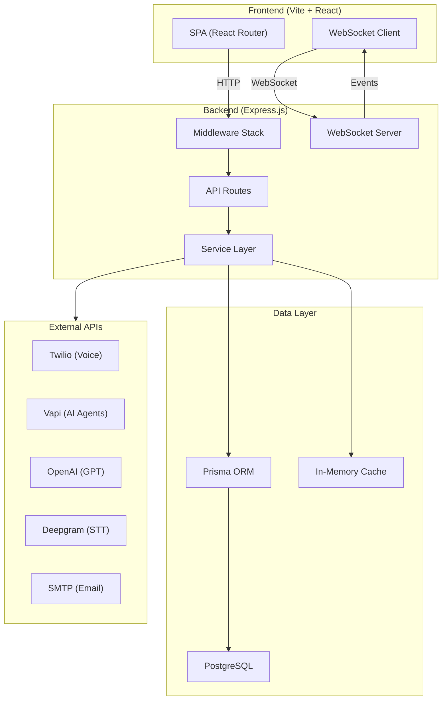
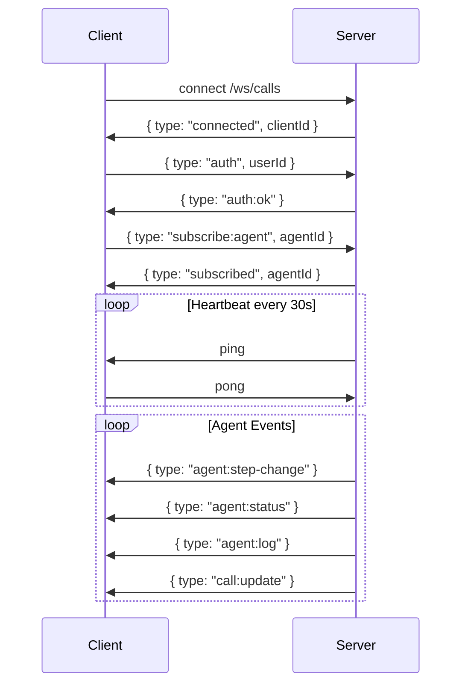
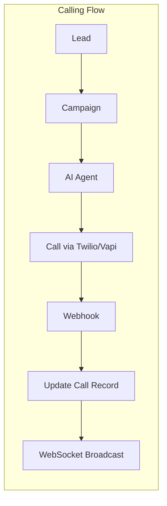

# Business Hub API — Architecture

## System Overview



## Middleware Chain

```
Request → Helmet → CORS → JSON Parser → Sanitize → Request Logger → Rate Limiter → Auth → Route Handler → Error Handler
```

| Middleware | File | Purpose |
|---|---|---|
| Helmet | `helmet` (npm) | Security headers (X-Frame-Options, HSTS, etc.) |
| CORS | `cors` (npm) | Cross-origin resource sharing |
| Sanitize | `middleware/sanitize.js` | Strip XSS from body/query/params |
| Request Logger | `middleware/requestLogger.js` | Log method, URL, status, duration |
| Rate Limiter | `middleware/rateLimiter.js` | 100 req/15min (general), 10 req/5min (auth) |
| Auth | `middleware/auth.js` | `x-user-id` header validation |
| Error Handler | `middleware/errorHandler.js` | Global catch-all for unhandled errors |

## API Route Map

| Prefix | Route File | Auth | Description |
|---|---|---|---|
| `/api/auth` | `routes/auth.js` | ❌ | Login, register, profile |
| `/api/leads` | `routes/leads.js` | ✅ | Lead CRUD + pipeline |
| `/api/jobs` | `routes/jobs.js` | ✅ | Job CRUD + applications |
| `/api/contents` | `routes/contents.js` | ✅ | Content studio |
| `/api/resources` | `routes/extra.js` | ✅ | Task boards, templates, settings |
| `/api/skillmastery` | `routes/skillMastery.js` | ✅ | Skill tracking + mastery |
| `/api/calls` | `routes/calls.js` | ✅ | Call CRUD, scripts, stats |
| `/api/agents` | `routes/agents.js` | ✅ | AI agent management |
| `/api/campaigns` | `routes/campaignRoutes.js` | ✅ | Campaign CRUD + analytics |
| `/api/calls/twilio` | `routes/twilioWebhooks.js` | Twilio | Twilio webhooks |
| `/api/calls/vapi` | `routes/vapiWebhooks.js` | ❌ | Vapi webhooks |

## WebSocket Events



## Data Flow



## Directory Structure

```
server/
├── config/           # Database, logger, env validation
│   ├── prisma.js
│   ├── logger.js
│   └── validateEnv.js
├── middleware/        # Express middleware
│   ├── auth.js
│   ├── errorHandler.js
│   ├── rateLimiter.js
│   ├── requestLogger.js
│   ├── sanitize.js
│   └── security.js
├── routes/            # API route handlers
├── services/          # Business logic
├── adapters/          # External API adapters (Twilio, Vapi, Deepgram)
├── repositories/      # Data access layer
└── index.js           # Server entry point
```
