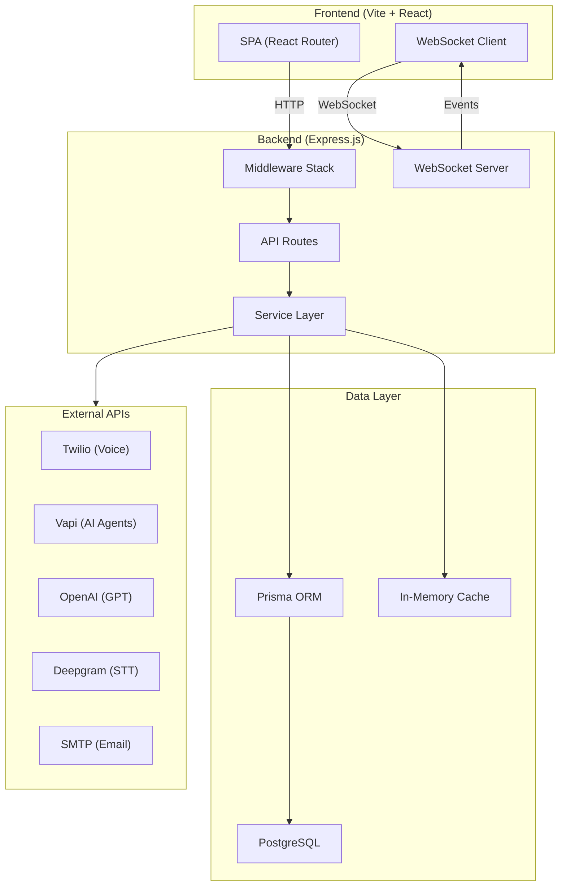
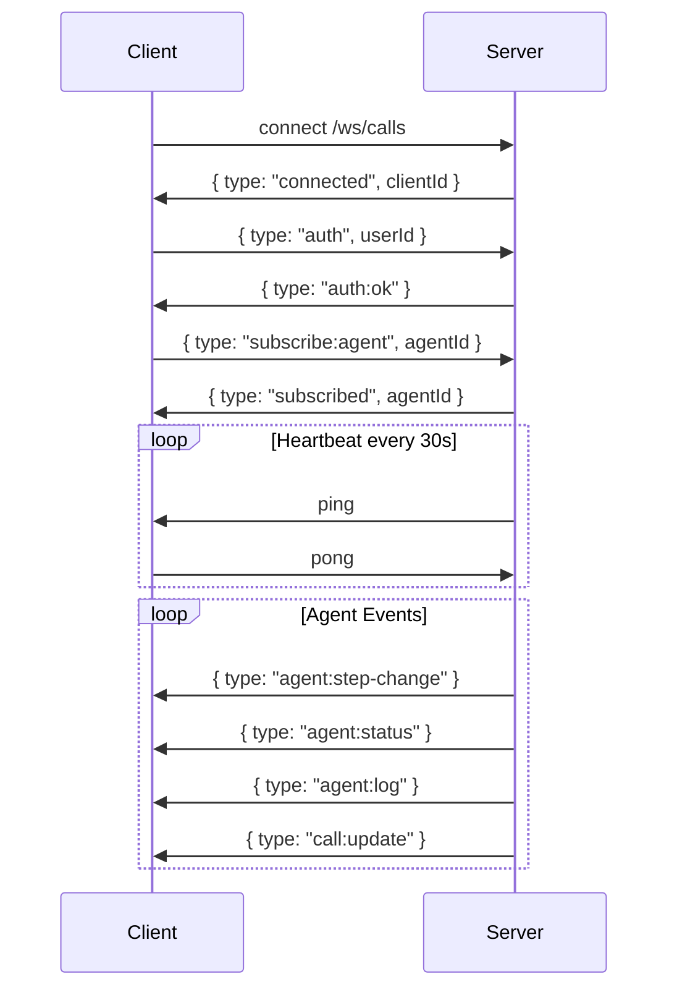
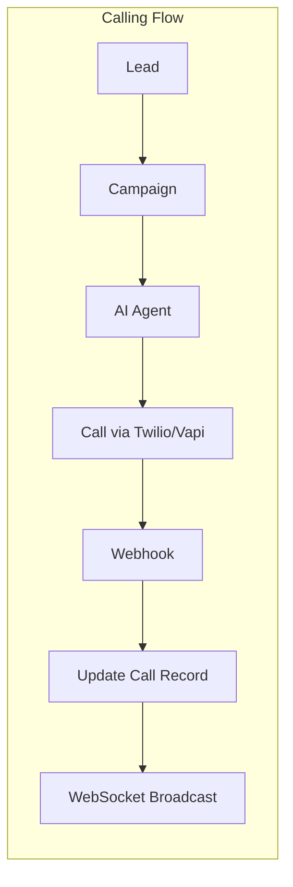

# Business Hub API — Architecture

## System Overview



## Middleware Chain

```
Request → Helmet → CORS → JSON Parser → Sanitize → Request Logger → Rate Limiter → Auth → Route Handler → Error Handler
```

| Middleware | File | Purpose |
|---|---|---|
| Helmet | `helmet` (npm) | Security headers (X-Frame-Options, HSTS, etc.) |
| CORS | `cors` (npm) | Cross-origin resource sharing |
| Sanitize | `middleware/sanitize.js` | Strip XSS from body/query/params |
| Request Logger | `middleware/requestLogger.js` | Log method, URL, status, duration |
| Rate Limiter | `middleware/rateLimiter.js` | 100 req/15min (general), 10 req/5min (auth) |
| Auth | `middleware/auth.js` | `x-user-id` header validation |
| Error Handler | `middleware/errorHandler.js` | Global catch-all for unhandled errors |

## API Route Map

| Prefix | Route File | Auth | Description |
|---|---|---|---|
| `/api/auth` | `routes/auth.js` | ❌ | Login, register, profile |
| `/api/leads` | `routes/leads.js` | ✅ | Lead CRUD + pipeline |
| `/api/lead-types` | `routes/leadTypes.js` | ✅ | Lead type/niche management (CRUD) |
| `/api/jobs` | `routes/jobs.js` | ✅ | Job CRUD + applications |
| `/api/contents` | `routes/contents.js` | ✅ | Content studio |
| `/api/resources` | `routes/extra.js` | ✅ | Task boards, templates, settings |
| `/api/skillmastery` | `routes/skillMastery.js` | ✅ | Skill tracking + mastery |
| `/api/calls` | `routes/calls.js` | ✅ | Call CRUD, scripts, scheduling, stats |
| `/api/agents` | `routes/agents.js` | ✅ | AI agent management |
| `/api/campaigns` | `routes/campaignRoutes.js` | ✅ | Campaign CRUD + analytics |
| `/api/calls/twilio` | `routes/twilioWebhooks.js` | Twilio | Twilio webhooks |
| `/api/calls/vapi` | `routes/vapiWebhooks.js` | ❌ | Vapi webhooks |
| `/api/webhooks` | `routes/webhooks.js` | ❌ | External webhook handlers (server-to-server) |
| `/api/intelligence` | `routes/intelligence.js` | ✅ | Lead analysis, insights, leaderboard |
| `/api/proposals` | `routes/proposals.js` | ✅ | Proposal CRUD + AI generation |
| `/api/notifications` | `routes/notifications.js` | ✅ | Notification system |
| `/api/dashboard` | `routes/dashboard.js` | ✅ | Dashboard aggregation + stats |
| `/api/automation` | `routes/automation.js` | ✅ | Automation engine triggers |
| `/api/scraper` | `routes/scraper.js` | ✅ | Web scraping for lead discovery |
| `/api/outreach` | `routes/outreach.js` | ✅ | Automated outreach campaigns |
| `/api/email` | `routes/email.js` | ✅ | Email sending + templates |
| `/api/messages` | `routes/messages.js` | ✅ | Messaging system |

## WebSocket Events



## Data Flow



### Intelligence → Deal Desk Flow

```
Lead (/leads)
  │
  ├── Status changed ──► EventBus: lead:status-changed ──┐
  ├── Call completed ──► EventBus: call:completed ────────┤
  └── Manual "Analyze" button ───────────────────────────┤
                                                          ▼
                                          intelligenceService.analyzeLead()
                                            │
                                   ┌────────┴─────────┐
                                   ▼                   ▼
                            LLM Analysis         Heuristic Fallback
                            (OpenAI)              (callCount + sentiment)
                                   │                   │
                                   └────────┬──────────┘
                                            ▼
                                  Upsert LeadIntelligence
                                  (dealHeat, buyingIntent, budget, etc.)
                                            │
                                            ▼
                                  Deal Desk Pipeline (/dealdesk)
                                  GET /intelligence/leaderboard
                                  → Kanban: Critical | High | Medium | Low
                                            │
                                            ▼
                                  POST /proposals/generate/:leadId
                                  → Proposal: Draft → Sent → Accepted/Rejected
```

## Background Services

| Service | File | Interval | Description |
|---|---|---|---|
| Call Scheduler | `services/callSchedulerService.js` | 30s | Polls for `status=scheduled, scheduledAt <= now`, processes max 20 calls per tick via `callService.initiateCall` with `existingCallId` to reuse the scheduled record |
| Stuck Call Reconciler | `services/callService.js` (reconcileStuckCalls) | On-demand (each `getAll`) | Marks `queued` calls older than 2 minutes as `failed` after checking provider status |

### Call Scheduler Flow

```
scheduled call (scheduledAt <= now)
  → callSchedulerService._processDueCalls()
    → callService.initiateCall({ existingCallId })
      → prisma.call.update (scheduled → queued → ringing/in-progress)
      → telephony.initiateCall()
      → single call record throughout lifecycle
```

## Directory Structure

```
server/
├── config/           # Database, logger, env validation
│   ├── prisma.js
│   ├── logger.js
│   └── validateEnv.js
├── middleware/        # Express middleware
│   ├── auth.js
│   ├── errorHandler.js
│   ├── rateLimiter.js
│   ├── requestLogger.js
│   ├── sanitize.js
│   └── security.js
├── routes/            # API route handlers
├── services/          # Business logic
├── adapters/          # External API adapters (Twilio, Vapi, Deepgram)
├── repositories/      # Data access layer
└── index.js           # Server entry point
```
