# BMAD Epics — Business Hub

> Derived from the walkthrough and E2E testing sessions (2026-02-13).
> Each epic follows BMAD format: Objective → Stories → Acceptance Criteria → Priority → Dependencies.

---

## Epic 1: API Error Handling Hardening

**Objective:** Eliminate all Prisma error leaks and ensure every API endpoint returns clean, consistent JSON error responses with correct HTTP status codes.

**Status:** 🟡 Partially complete — leads, jobs, auth register, and taskboard GET /:id are fixed.

### Story 1.1 — Audit & fix `extra.js` routes (P0)

> The `extra.js` file contains CRUD routes for taskboards, tasks, templates, template folders, email templates, email settings, job search prompts, and settings. These routes catch Prisma errors with `e.message` which leaks internals on not-found operations.

**Acceptance Criteria:**
- [ ] Every `PATCH /:id`, `PUT /:id`, `DELETE /:id` route in `extra.js` checks record existence before mutating
- [ ] Not-found returns HTTP 404 with `{ error: "<Resource> not found" }`
- [ ] Prisma error strings never appear in response bodies
- [ ] All other errors return HTTP 400

**Technical Notes:**
- Pattern: add `findFirst()` guard before `update()`/`delete()` calls, same as [leadService.js](file:///home/hanzla/development/teaching/schedule-manager/server/services/leadService.js)
- Affects: taskboards, tasks, templates, template folders, email templates, settings

**Files:** [extra.js](file:///home/hanzla/development/teaching/schedule-manager/server/routes/extra.js)

---

### Story 1.2 — Audit & fix content routes (P1)

**Acceptance Criteria:**
- [ ] `GET /contents/:id` returns 404 if content not found
- [ ] `PATCH /contents/:id`, `DELETE /contents/:id` guard against non-existent IDs
- [ ] Error responses are clean JSON

**Files:** [contents.js](file:///home/hanzla/development/teaching/schedule-manager/server/routes/contents.js)

---

### Story 1.3 — Global error middleware (P2)

> Instead of repeating status-code logic in every route, add a centralized error handler.

**Acceptance Criteria:**
- [ ] Create `NotFoundError` and `ValidationError` custom error classes
- [ ] Add Express error middleware that maps error types to HTTP status codes
- [ ] Routes throw typed errors instead of doing `res.status(N).json()`
- [ ] Prisma `P2025` (record not found) auto-maps to 404

**Dependencies:** Stories 1.1, 1.2 (understand the patterns first)

**Files:**
- `[NEW]` `server/middleware/errorHandler.js`
- `[NEW]` `server/errors/index.js`
- `[MODIFY]` All route files to use `next(err)` pattern

---

### Story 1.4 — Input validation layer (P2)

**Acceptance Criteria:**
- [ ] Register: validate email format + password length (≥6 chars)
- [ ] Lead create: require `name` and `status`
- [ ] Job create: require `title` and `company`
- [ ] Return `{ error: "Validation failed", fields: {...} }` with HTTP 422

**Dependencies:** Story 1.3

---

## Epic 2: E2E Test Automation

**Objective:** Convert the manual E2E test plan in [E2E-TESTING.md](file:///home/hanzla/development/teaching/schedule-manager/docs/E2E-TESTING.md) into automated Playwright tests.

**Status:** 🔴 Not started — all 12 suites are manual scripts today.

### Story 2.1 — Playwright setup + API test harness (P0)

**Acceptance Criteria:**
- [ ] `pnpm add -D @playwright/test` installed
- [ ] `playwright.config.ts` created with base URL, timeouts, and web server setup
- [ ] Test helper with `login()`, `createLead()`, `createJob()` utility functions
- [ ] Can run `pnpm test:e2e` from CLI

**Files:**
- `[NEW]` `playwright.config.ts`
- `[NEW]` `tests/e2e/helpers.ts`
- `[MODIFY]` `package.json` — add `test:e2e` script

---

### Story 2.2 — API test suites 1–6 (P0)

> Health, Auth, Leads CRUD, Jobs CRUD, Task Boards, Templates

**Acceptance Criteria:**
- [ ] Test Suite 1: health check + CORS
- [ ] Test Suite 2: register, login, duplicate registration
- [ ] Test Suite 3: Leads full CRUD cycle (list, create, GET by ID, PUT, DELETE)
- [ ] Test Suite 4: Jobs full CRUD cycle
- [ ] Test Suite 5: Task Boards (list, create, GET by ID)
- [ ] Test Suite 6: Templates (list, create)
- [ ] All tests pass in CI without manual setup

**Files:** `[NEW]` `tests/e2e/api/*.spec.ts`

---

### Story 2.3 — API test suites 7–10 (P1)

> Outreach, CV files, Email settings, Skill Mastery

**Acceptance Criteria:**
- [ ] Test Suite 7: Outreach uncontacted + history
- [ ] Test Suite 8: CV list (empty state)
- [ ] Test Suite 9: Email settings + templates
- [ ] Test Suite 10: Skill Mastery dashboard
- [ ] Scraper test mocked (no external Google dependency)

**Files:** `[NEW]` `tests/e2e/api/*.spec.ts`

---

### Story 2.4 — Browser UI test suite (P1)

> Converts Test Suite 11 from E2E-TESTING.md into Playwright browser tests.

**Acceptance Criteria:**
- [ ] Login page renders correctly
- [ ] Registration flow → redirect to dashboard
- [ ] All 9 sidebar pages navigate and render content
- [ ] Lead CRUD via UI (add lead card, appears in column)
- [ ] Job CRUD via UI
- [ ] Theme toggle changes background
- [ ] Settings modal opens with 3 tabs
- [ ] API Keys tab shows 6 provider cards

**Dependencies:** Story 2.1

**Files:** `[NEW]` `tests/e2e/ui/*.spec.ts`

---

### Story 2.5 — Cleanup + CI integration (P2)

**Acceptance Criteria:**
- [ ] Test Suite 12: cleanup deletes all test data
- [ ] GitHub Actions workflow runs E2E tests on PR
- [ ] Docker Compose starts DB for CI
- [ ] Tests are idempotent (can re-run without manual cleanup)

**Dependencies:** Stories 2.2, 2.3, 2.4

**Files:**
- `[NEW]` `.github/workflows/e2e.yml`
- `[NEW]` `tests/e2e/cleanup.spec.ts`

---

## Epic 3: API Keys & Per-User Configuration

**Objective:** Complete and harden the per-user API key management system documented in [API-KEYS-SETTINGS.md](file:///home/hanzla/development/teaching/schedule-manager/docs/API-KEYS-SETTINGS.md).

**Status:** 🟡 Core implemented — UI + storage works. Needs adapter integration testing and key masking.

### Story 3.1 — API key masking in responses (P0)

**Acceptance Criteria:**
- [ ] `GET /api/resources/settings` returns masked keys (e.g., `sk-****5678`)
- [ ] Full keys are never sent to the client after initial save
- [ ] Saving with masked value does NOT overwrite the stored key

**Files:**
- `[MODIFY]` [extra.js](file:///home/hanzla/development/teaching/schedule-manager/server/routes/extra.js) — settings GET route
- `[MODIFY]` `server/services/apiKeyService.js` — mask utility

---

### Story 3.2 — Adapter cache invalidation (P1)

**Acceptance Criteria:**
- [ ] When a user saves new API keys, the per-user adapter cache is invalidated
- [ ] Next API call for that user creates fresh adapters with updated keys
- [ ] Other users' caches are unaffected

**Files:** `server/services/apiKeyService.js`

---

### Story 3.3 — API key validation on save (P1)

**Acceptance Criteria:**
- [ ] Vapi key: validated with test API call before saving
- [ ] OpenAI key: validated with `GET /v1/models` call
- [ ] Invalid keys rejected with `{ error: "Invalid API key for <provider>" }`
- [ ] UI shows success/error toast per provider

**Dependencies:** Story 3.1

**Files:**
- `[NEW]` `server/services/apiKeyValidator.js`
- `[MODIFY]` `src/modules/settings/components/ApiKeysTab.tsx`

---

### Story 3.4 — Key rotation audit logging (P3)

**Acceptance Criteria:**
- [ ] Each key change is logged with timestamp, user, and provider
- [ ] Admins can view key change history
- [ ] Old keys are not stored (only current + change log)

---

## Epic 4: Henderson EV Go-Live Readiness

**Objective:** Complete all non-code blockers to run the first live AI calling campaign against Henderson EV contractor leads.

**Status:** 🔴 Blocked on Twilio account upgrade.

> Reference: [HENDERSON-EV-CALLING-EPIC.md](file:///home/hanzla/development/teaching/schedule-manager/docs/HENDERSON-EV-CALLING-EPIC.md)

### Story 4.1 — Twilio account upgrade (P0, non-code)

**Acceptance Criteria:**
- [ ] Twilio account upgraded with $20 minimum top-up
- [ ] Trial restrictions removed
- [ ] Can call unverified phone numbers

---

### Story 4.2 — Webhook public URL setup (P0)

**Acceptance Criteria:**
- [ ] `WEBHOOK_BASE_URL` env var set to public URL (ngrok or deployed server)
- [ ] Vapi webhook endpoint reachable from internet
- [ ] Twilio webhook endpoints reachable from internet
- [ ] Status callbacks work end-to-end

**Files:** `[MODIFY]` `.env`

---

### Story 4.3 — End-to-end call test (P0)

**Acceptance Criteria:**
- [ ] Call personal number using Vapi adapter
- [ ] AI assistant speaks configured greeting
- [ ] Conversation flows naturally (STT + LLM + TTS pipeline works)
- [ ] Call status webhook received and Call record updated in DB
- [ ] End-of-call-report received with transcript
- [ ] SMS follow-up sent to interested leads

**Dependencies:** Stories 4.1, 4.2

---

### Story 4.4 — Tier-1 batch call (P1)

**Acceptance Criteria:**
- [ ] Dry-run confirms 8 tier-1 contractors loaded
- [ ] DNC filter excludes opted-out numbers
- [ ] All 8 calls complete with status tracking
- [ ] Interested leads tagged + SMS sent
- [ ] Campaign analytics show per-call results

**Dependencies:** Story 4.3

---

### Story 4.5 — Campaign analytics dashboard (P2)

**Acceptance Criteria:**
- [ ] Campaign detail page shows funnel (Total → Connected → Interested → Meeting)
- [ ] Per-call transcripts viewable
- [ ] Cross-campaign analytics endpoint returns aggregate stats
- [ ] Batch transcription works for recorded calls

---

## Priority Matrix

| Priority | Stories | Effort |
|---|---|---|
| **P0** (must-have) | 1.1, 2.1, 2.2, 3.1, 4.1, 4.2, 4.3 | ~3 days |
| **P1** (should-have) | 1.2, 2.3, 2.4, 3.2, 3.3, 4.4 | ~3 days |
| **P2** (nice-to-have) | 1.3, 1.4, 2.5, 4.5 | ~2 days |
| **P3** (future) | 3.4 | ~1 day |

## Dependency Graph

```mermaid
graph TD
  subgraph Epic_1["Epic 1: Error Handling"]
    S1_1["1.1 extra.js routes"]
    S1_2["1.2 content routes"]
    S1_3["1.3 Global error middleware"]
    S1_4["1.4 Input validation"]
    S1_1 --> S1_3
    S1_2 --> S1_3
    S1_3 --> S1_4
  end

  subgraph Epic_2["Epic 2: E2E Automation"]
    S2_1["2.1 Playwright setup"]
    S2_2["2.2 API tests 1-6"]
    S2_3["2.3 API tests 7-10"]
    S2_4["2.4 Browser UI tests"]
    S2_5["2.5 CI integration"]
    S2_1 --> S2_2
    S2_1 --> S2_3
    S2_1 --> S2_4
    S2_2 --> S2_5
    S2_3 --> S2_5
    S2_4 --> S2_5
  end

  subgraph Epic_3["Epic 3: API Keys"]
    S3_1["3.1 Key masking"]
    S3_2["3.2 Cache invalidation"]
    S3_3["3.3 Key validation"]
    S3_4["3.4 Audit logging"]
    S3_1 --> S3_3
    S3_3 --> S3_4
  end

  subgraph Epic_4["Epic 4: Henderson EV"]
    S4_1["4.1 Twilio upgrade"]
    S4_2["4.2 Webhook URL"]
    S4_3["4.3 E2E call test"]
    S4_4["4.4 Tier-1 batch"]
    S4_5["4.5 Analytics dashboard"]
    S4_1 --> S4_3
    S4_2 --> S4_3
    S4_3 --> S4_4
    S4_4 --> S4_5
  end
```

