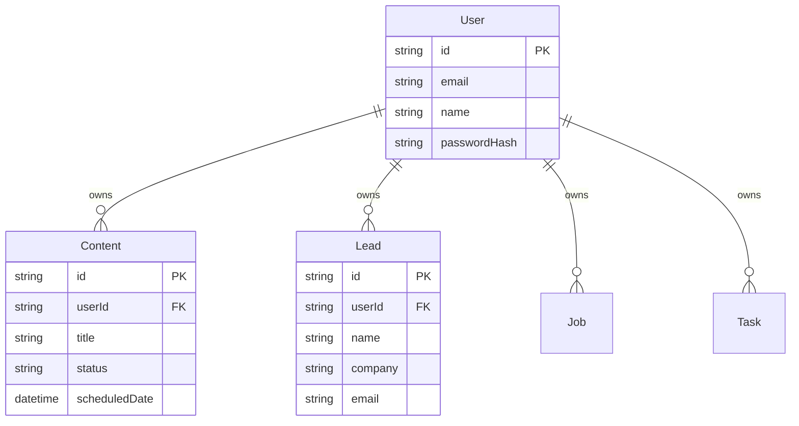

# Database Migration Plan: JSON Server to PostgreSQL (Prisma)

This document outlines the strategy for migrating the Schedule Manager (Business Hub) from a local JSON-based database to a production-ready PostgreSQL database using Prisma ORM.

## 🚀 Objectives
- Migrate all data from `db.json` to PostgreSQL without any data loss.
- Assign all existing professional data to a specific user (your email/account).
- Implement a robust, scalable backend architecture.
- Simplify deployment and local development using Docker Compose.

## 📋 Prerequisites
Before starting the migration, ensure you have the following installed:
- **Docker & Docker Compose**: To run PostgreSQL and the application containers.
- **Node.js**: (Already present in your environment).
- **Postgres Client**: (Optional) Tools like pgAdmin or DBeaver to inspect the database.

---

## 🛡️ Data Safety Strategy
1. **Backup**: Create a physical copy of `db.json` before any operations.
2. **Dry Run**: Validate the migration script by logging the proposed database operations before executing them.
3. **Atomic Migration**: Use database transactions during the initial data import to ensure that if one record fails, the entire import rolls back (preventing partial/corrupted data).
4. **Validation**: Run a comparison script post-migration to verify record counts match between `db.json` and Postgres.

---

## 🛠️ Implementation Phases

### 1. Schema Definition (Prisma)
- Initialize Prisma in the project: `npx prisma init`.
- Define the `schema.prisma` mapping existing collections (`contents`, `leads`, `jobs`, etc.) to relational tables.
- **Critical Change**: Add a `userId` relation to every table to support multi-tenancy and ownership.

### 2. Dockerization
- **Dockerfile**: Create a multi-stage build for the Vite frontend and Express backend.
- **docker-compose.yml**: Orchestrate three services:
  - `db`: PostgreSQL container with persistent volumes.
  - `backend`: The Express API server connecting to Postgres via Prisma.
  - `frontend`: The Vite dev/production server.

### 3. Migration Script (The "ETL" Process)
A custom script will:
- Read the final `db.json`.
- Create your primary user in the `User` table.
- Iterate through all collections and insert them into Postgres, setting the `userId` to your new account ID.

### 4. API Layer Refactor
- Replace the `apiClient` logic that currently hits JSON Server with calls to the new Express endpoints.
- Update the Express backend to use Prisma Client for all CRUD operations.

---

## 💡 Recommendations for Long-Term Success

### Use Docker Compose (Recommended)
**Why?**
- **Environment Parity**: Ensures the app runs exactly the same on your machine as it does on a server.
- **One-Command Setup**: `docker-compose up` starts everything (DB, Backend, Frontend).
- **Isolations**: Database dependencies are kept inside containers, keeping your host machine clean.

### Alternatives
- **Cloud Managed DB (e.g., Supabase/Neon)**: Best if you don't want to manage a database container yourself. Extremely easy to scale.
- **Railway/Render**: Integrated platforms that handle Docker builds and DB hosting automatically.

---

## 📐 Proposed Database Schema (Partial)

> [!IMPORTANT]
> Once the migration to Prisma is complete, the `db.json` file will be retired and no longer used by the application.
