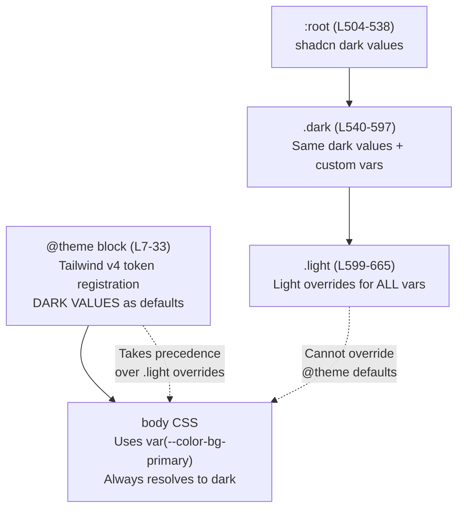

# Dark/Light Mode Theme Audit — Business Hub

> **Date:** 2026-02-17  
> **Status:** Findings documented, ready for implementation  
> **Severity:** High — Light mode is completely unusable

---

## Root Cause Analysis

The theme system has a **CSS variable scoping conflict** that prevents light mode from working:

### CSS Architecture Layers (in `index.css`)



### The Core Bug

1. **`@theme` block** (lines 7-33) registers CSS custom properties with **dark-mode values as Tailwind tokens**. These become the authoritative values for utility classes like `bg-bg-primary`, `text-text-primary`, etc.

2. **`.light` class** (lines 599-665) overrides these same variables — which works for elements using `var()` directly, but **does NOT affect Tailwind utility classes** generated from `@theme` tokens because Tailwind v4 resolves `@theme` values at build time.

3. **`body` background** uses `var(--color-bg-primary)` directly in CSS (line 42), which DOES respond to `.light` overrides. But many components use Tailwind utilities like `bg-bg-primary` that are locked to the `@theme` dark value.

4. **Hardcoded dark colors** throughout components (`bg-white/5`, `text-white`, `bg-black/20`, `rgba(22, 27, 34, 0.6)`) have no `dark:` prefix or light-mode alternatives.

---

## Light Mode Evidence

### Dashboard (light mode active)


**Issues visible:** Cards become washed-out gray (`rgba(255,255,255,0.7)`) while body stays dark. "Floating light card" effect.

### Calendar (light mode active)


**Issues visible:** Calendar grid stays pitch black, sidebar barely changes, header stays dark.


---

## Affected Components

### Global / Shared

| Component | File | Issue |
|-----------|------|-------|
| **Sidebar** | `src/shared/components/Sidebar.tsx` | Dark background hardcoded, no light variant |
| **AppHeader** | `src/components/AppHeader.tsx` | Uses `bg-black/20`, `border-white/10` — stays dark |
| **body** | `src/index.css` (line 42) | `var(--color-bg-primary)` — partially works but `@theme` conflicts |
| **glass-card** | `src/index.css` (L737-756) | Light variant exists (`rgba(255,255,255,0.7)`) but looks washed out on dark body |
| **glass-panel** | `src/index.css` (L729-734) | Light variant exists (L758-761) but header still dark |
| **Select/dropdown** | `src/index.css` (L53-109) | Hardcoded dark colors without light variants |
| **Scrollbar** | `src/index.css` (L112-128) | Uses CSS vars (partially works) |

### Page-Specific Issues

| Page | File | Hardcoded Dark Classes |
|------|------|----------------------|
| **Dashboard** | `DashboardView.tsx` | `bg-white/5`, `bg-white/10`, `text-white`, `bg-gray-800` |
| **Deal Desk** | `DealDeskView.tsx` | `bg-bg-secondary` (works via var), but kanban column dividers use hardcoded colors |
| **Neural Brain** | `NeuralBrainView.tsx` | `bg-white/10`, `bg-bg-tertiary/30` (partially works) |
| **Calendar** | `WeekView.tsx` | Likely hardcoded dark grid colors |
| **Automation** | `AutomationView.tsx` | Title/search container uses hardcoded dark |
| **AI Calling** | `CallingCalendarGrid.tsx`, `CallingScheduleSidebar.tsx` | Has `dark:` prefixes (better) but defaults to light Tailwind classes (`bg-white`, `bg-slate-100`) |

---

## Fix Priority List

### P0 — Must Fix (body + global chrome)

1. **Fix `@theme` / `.light` conflict** — Move custom property defaults out of `@theme` block OR duplicate light values into `@theme` with media query  
   - Effort: ~30 min  
   - File: `src/index.css`

2. **Sidebar light mode** — Add light variant backgrounds and text colors  
   - Effort: ~20 min  
   - File: `src/shared/components/Sidebar.tsx`

3. **AppHeader light mode** — Replace `bg-black/20` with theme-aware class  
   - Effort: ~15 min  
   - File: `src/components/AppHeader.tsx`

### P1 — Critical Pages

4. **Dashboard card backgrounds** — Replace `bg-white/5` / `bg-white/10` with `bg-card` or `bg-bg-tertiary` across all dashboard cards  
   - Effort: ~30 min  
   - File: `src/modules/dashboard/DashboardView.tsx`

5. **Calendar grid** — Add light mode grid backgrounds  
   - Effort: ~30 min  
   - File: `src/modules/schedule/components/WeekView.tsx`

6. **Neural Brain cards** — Replace hardcoded dark overlays  
   - Effort: ~15 min  
   - File: `src/modules/brain/NeuralBrainView.tsx`

### P2 — Secondary Pages

7. **Deal Desk** — Mostly works via CSS vars, minor fixes needed  
   - Effort: ~15 min  

8. **Automation** — Fix title/container backgrounds  
   - Effort: ~15 min  

9. **AI Calling** — Already has `dark:` prefixes, needs testing  
   - Effort: ~10 min  

### P3 — Polish

10. **Select/dropdown menus** — Light mode styling exists (L667-683) but needs verification  
11. **scrollbar** — Partially works, may need fine-tuning  
12. **glass-card light variant** — Improve from washed-out gray to clean white with shadow  

---

## Recommended Implementation Strategy

### Option A: Fix `@theme` Block (Recommended)

Move the custom vars OUT of `@theme` and into `:root` only, then use Tailwind's `@theme inline` to register them as utilities:

```diff
-@theme {
-  --color-bg-primary: #09090b;
-  ...
-}
+:root {
+  --color-bg-primary: #09090b;
+  ...
+}
+.light {
+  --color-bg-primary: #ffffff;
+  ...
+}
+@theme inline {
+  --color-bg-primary: var(--color-bg-primary);
+  ...
+}
```

### Option B: Dual `@theme` with `prefers-color-scheme`

Use CSS media queries within `@theme` — but Tailwind v4 may not support this.

### Option C: Replace `@theme` Custom Vars with Hardcoded `dark:` Prefixes

Replace all `bg-bg-secondary` usages with `bg-zinc-900 dark:bg-zinc-900` / `bg-zinc-100 light:bg-zinc-100` — most labor-intensive but most explicit.

> **Recommendation:** **Option A** — minimal disruption, fixes the root cause.

---

## How to Verify

1. Switch to light mode via the theme toggle (🌙/☀️ button in header)
2. Check these pages: `/dashboard`, `/`, `/brain`, `/dealdesk`, `/automation`, `/calling`
3. Verify:
   - Body background is white/light
   - Sidebar has light background
   - Header has light background
   - Cards have clean white/light backgrounds with proper shadows
   - Text is readable (dark text on light backgrounds)
   - Charts/sparklines are visible
4. Switch back to dark mode — verify no regressions
