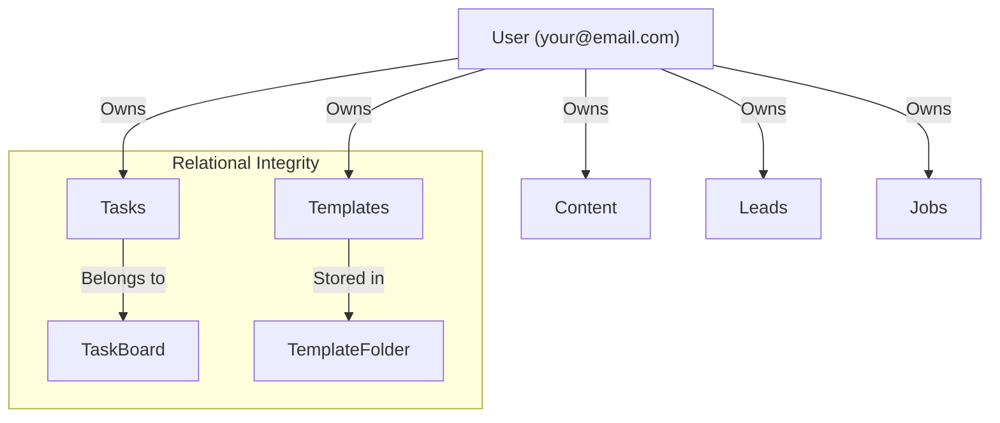
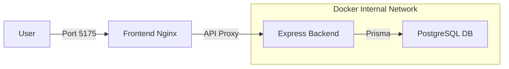

# Migration Architecture: The Big Picture

This document describes the high-level architecture transition from the current JSON Server mock backend to a production-grade PostgreSQL backend.

## 🏛️ System Overview

### Before (Current)
- **Data Source**: A single `db.json` file.
- **API**: `json-server` (Mocks REST endpoints).
- **Storage**: Flat files, no relations, no ACID compliance.
- **Auth**: Client-managed login state with fake token injection.

### After (Implementation Plan)
- **Data Source**: PostgreSQL (Relational DB).
- **ORM**: Prisma (Type-safe access).
- **API**: Custom Express Server (Production ready).
- **Docker**: Containerized environment for reproducible deployments.

## 🔄 The Data Ownership Flow
In the new system, every piece of data is "owned" by a `User`. This allows multi-users to coexist while your data stays isolated to `your@email.com`.

## 🏗️ Backend Layered Architecture
We will refactor the `server/` directory from a simple entry point to a layered architecture.

| Layer | Responsibility |
|-------|----------------|
| **Controllers** | Handlers for HTTP requests (parsing params, sending responses). |
| **Services** | Core business logic (e.g., "Schedule a post", "Calculate ROI"). |
| **Repositories** | Direct Prisma database calls (`findMany`, `create`, `update`). |
| **Models** | Prisma generated TypeScript types. |

## 🐳 Docker Deployment Strategy
The app will live in a "Docker Network" where only the Frontend and API are exposed to you, while the Database stays internal for security.

## 🔒 Safety Steps
1. **db.json snapshot**: Immediate copy before any migration tool runs.
2. **Migration Audit Log**: Every row successfully moved to Postgres will be logged to a `migration_report.json`.
3. **Rollback Script**: A script to wipe the Postgres DB if the migration fails halfway, allowing a fresh start.
