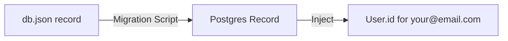

# Data Mapping: db.json to PostgreSQL

This document tracks exactly how data is transformed during the migration to ensure 0% data loss.

## 🗺️ Collection Mapping Table

| JSON Collection | Prisma Model | Key Transformations |
|-----------------|--------------|---------------------|
| `contents` | `Content` | `item.scheduledDate` (string) → `DateTime` |
| `leads` | `Lead` | Flat structure → Linked to `User` |
| `jobs` | `Job` | Flat structure → Linked to `User` |
| `tasks` | `Task` | `item.id` → `auto-generated CUID` |
| `taskBoards` | `TaskBoard` | Linked to multiple `Task` records |
| `users` | `User` | `password` (plain) → `passwordHash` (BCrypt) |

## 🔑 Global Identity Injection
Every single record migrated will receive a `userId` property.

## 🛠️ Field Sanitization
- **Dates**: Any `null` or empty strings in `db.json` date fields will be normalized to `null` or `now()`.
- **Strings**: Trimming leading/trailing whitespace.
- **Relations**: Since `db.json` uses simple IDs (e.g., `boardId: "board-1"`), the script will map these to the new relational ID system.

## 📊 Verification Metrics
After migration, we will generate a report:
- **Total Input Records**: 439
- **Total Output Records**: 439
- **Error Log**: Any skipped/failed records with reasons.
